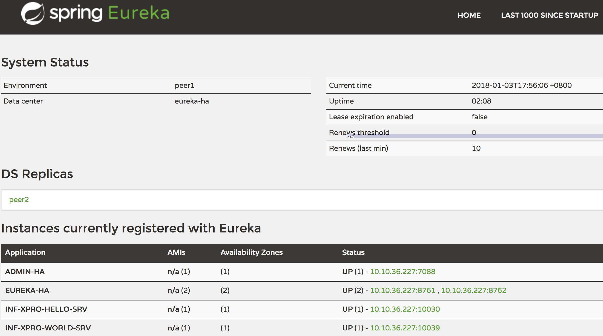
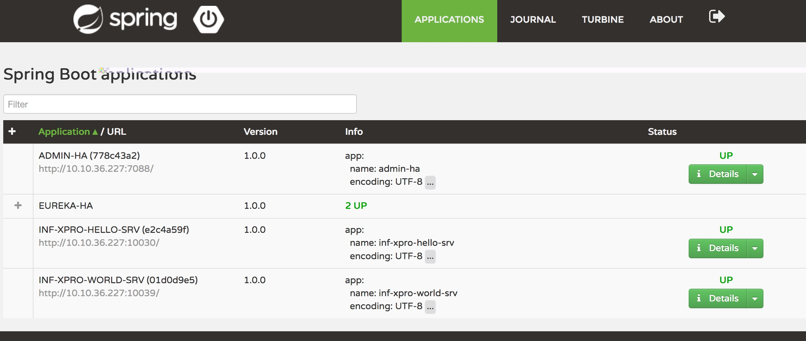
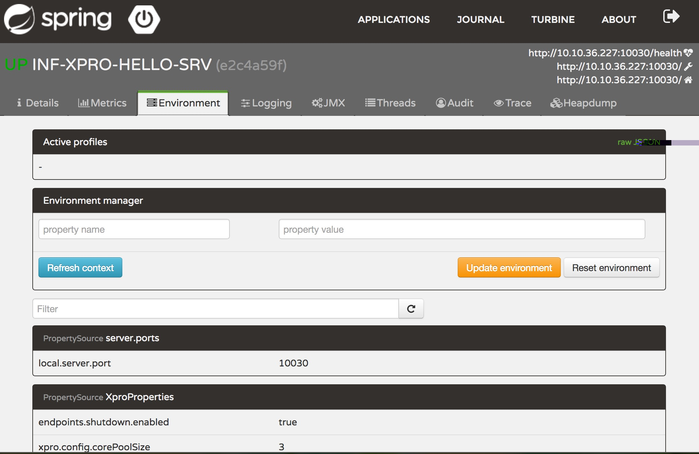

简介
==============
- 目的

  为了更好的进一步提升对金服目前的微服务体系监控能力，管控能力，稳定性，兼容性， 以及生态治理能力，我们吸收和引进了当前比较活跃和稳定的spring boot和spring cloud体系，并启动了新的 rpc 项目，即 xpro 项目。

- 使用技术栈

  选用时下经过验证的流行的微服务体系，即 Spring Cloud(Eureka Netflix， Hystrix Netflix，Zuul Netflix，Ribbon Netflix，Feign，Spring Cloud Cluster，Spring Cloud Starters 等);Spring Boot;Ribbon;Feign;Hystrix;Actuator;Bus MQ; Eureka 等技术体系。

- 概述

  基于四点技术选型原则，即不重新造轮子;选用经过考验的、仍然活跃维护的技术; 逐步降低对原RabbitMQ 的依赖;尽量重用公司已有的成果的四点原则，经过对spring boot 和spring cloud 的调研和使用经验，依赖 spring 的强大社区和经得住考验的稳 定性，发起了 xpro 项目，来解决我们目前的痛点。

模块
==============
- Eureka Server

  云端服务发现，一个基于 REST 的服务，用于定位服务，以实现云端中间层服务发现和故障转移。

- Spring Cloud Config

  配置管理工具包，让你可以把配置放到远程服务器，集中化管理集群配置，目前支持本地存储、Git以及Subversion。

- Spring Cloud Bus

  事件、消息总线，用于在集群（例如，配置变化事件）中传播状态变化，可与Spring Cloud Config联合实现热部署。

- Hystrix

  熔断器，容错管理工具，旨在通过熔断机制控制服务和第三方库的节点,从而对延迟和故障提供更强大的容错能力。

- Zuul
  
  Zuul 是在云平台上提供动态路由,监控,弹性,安全等边缘服务的框架。Zuul 相当于是设备和 Netflix 流应用的 Web 网站后端所有请求的前门。
  
- Ribbon
  
  提供云端负载均衡，有多种负载均衡策略可供选择，可配合服务发现和断路器使用。
  
- Turbine

  Turbine是聚合服务器发送事件流数据的一个工具，用来监控集群下hystrix的metrics情况。

- Feign

  Feign是一种声明式、模板化的HTTP客户端。
  
- Spring Cloud Starters

  Spring Boot式的启动项目，为Spring Cloud提供开箱即用的依赖管理。
  
- Spring Cloud Task

  提供云端计划任务管理、任务调度。

- Archaius（类似Spring Environment，但是支持动态和定时加载配置，API和设计没有Spring好）

  配置管理API，包含一系列配置管理API，提供动态类型化属性、线程安全配置操作、轮询框架、回调机制等功能。
  
- Consul

  封装了Consul操作，consul是一个服务发现与配置工具，与Docker容器可以无缝集成。
  
- Spring Cloud for Cloud Foundry

  通过Oauth2协议绑定服务到CloudFoundry，CloudFoundry是VMware推出的开源PaaS云平台。
  
- Spring Cloud Sleuth

  日志收集工具包，封装了Dapper和log-based追踪以及Zipkin和HTrace操作，为SpringCloud应用实现了一种分布式追踪解决方案。
  
- Spring Cloud Data Flow

  大数据操作工具，作为Spring XD的替代产品，它是一个混合计算模型，结合了流数据与批量数据的处理方式
  
- Spring Cloud Security

  基于spring security的安全工具包，为你的应用程序添加安全控制。
  
- Spring Cloud Zookeeper

  操作Zookeeper的工具包，用于使用zookeeper方式的服务发现和配置管理。
  
- Spring Cloud Stream

  数据流操作开发包，封装了与Redis,Rabbit、Kafka等发送接收消息。
  
- Spring Cloud CLI

  基于 Spring Boot CLI，可以让你以命令行方式快速建立云组件。
  
- Spring Cloud Connectors

  便于云端应用程序在各种PaaS平台连接到后端，如：数据库和消息代理服务。
  
- Spring Cloud Cluster

  提供Leadership选举，如：Zookeeper, Redis, Hazelcast, Consul等常见状态模式的抽象和实现。
  
- 部署结构如下图


详细设计
==============

- 远程服务发布

首先，在需要暴露为远程服务的接口所在包下创建 package-info.java 文件（网关调用TODO）， 并在包上添加注解@XproAppConfig(“appName”)，如下方式:
  
	@XproAppConfig(value = "xprodemo")
    package com.ly.fn.inf.xpro.plugin.examples.api;
    
    import com.ly.fn.inf.xpro.plugin.api.com.ly.fn.inf.xpro.plugin.api.annotation.XproAppConfig;

同时服务端也要指定这个应用的名称，Xpro默认是通过读取服务端的文件:appcation.properties来设置这个spring boot项目的名称的里面可以设置这个应用的名称和版本，如下图所示:

	app.name=xprodemo
	app.version=1.0.0

然后，在接口上标记注解 @RpcService ，并在每个方法上标注 @RpcMethod和@Sla 注解(主要用于标示异步特性)，如下:
```
    @RpcService(serviceGroup = "hello")
    public interface HelloService {
    
        String hello();
    
        User helloUser(User user, String name);
    
        void helloExp() throws AppBizException;
    }
```
```  
    @RpcService(serviceGroup = "hello")
    public interface AsyncHelloService {
    
        @RpcMethod(async = true)
        void voidHelloAsync();
    
        @RpcMethod(async = true)
        String helloAsync();
    
        @RpcMethod(async = true)
        void voidHelloAsyncExp() throws AppBizException;
    
        @RpcMethod(async = true)
        void voidHelloAsyncCallback(String str, @Callback CallbackService callback);
    }
```
然后在Eureka Server就能看到已经注册的服务列表的地址和端口



最后，在服务端实现上述需要暴露的接口，并注册到Spring容器，如下:
```
	@Component
    public class HelloServiceImpl implements HelloService {
    
        @Override
        public String hello() {
            System.out.println("HelloService received hello invocation");
            return "Hello World";
        }
    
        @Override
        public User helloUser(User user, String name) {
            System.out.printf("HelloService received helloUser invocation: args=%s\n", Arrays.toString(new Object[] {user, name}));
            user.setName(name);
            return user;
        }
    
        @Override
        public void helloExp() throws AppBizException {
            System.out.println("HelloService received helloExp invocation");
            throw new AppBizException("EXP.001");
        }
    }
```    
```
    @Component
    public class AsyncHelloServiceImpl implements AsyncHelloService {
    
        @Override
        public void voidHelloAsync() {
            System.out.println("AsyncHelloService received voidHelloAsync invocation");
        }
    
        @Override
        public String helloAsync() {
            System.out.println("AsyncHelloService received helloAsync invocation");
            return "Hello";
        }
    
        @Override
        public void voidHelloAsyncExp() throws AppBizException {
            System.out.println("AsyncHelloService received voidHelloAsyncExp invocation");
            throw new AppBizException("EXP.001");
        }
    
        @Override
        public void voidHelloAsyncCallback(String str, CallbackService callback) {
            System.out.printf("AsyncHelloService received voidHelloAsyncCallback invocation: args=%s\n", str);
            callback.callback();
        }
    }
```
- 远程服务代理

远程服务的引用需要在引入的接口上添加@Xprowired 注解（如果是老的服务，则继续使用@Rpcwired注入），同时在 Spring Boot 的启动入口增加@XproPluginApplication 注解即可，就可以通过 Ribbon 的代理和 调用本地方法一样调用远程的服务，如下:
```
	@Component
    public class Invoker {
    
        @Xprowired
        private HelloService helloService;
    
        @Xprowired
        private AsyncHelloService asyncHelloService;
    
        public void invoke() {
            System.out.println("HelloService method hello return: " + helloService.hello());
        }
    
        public User invokeUser() {
            User u = new User();
            u.setName("Susan");
    
            User user = helloService.helloUser(u, "Catelyn");
            System.out.println("HelloService method helloUser return: " + user);
            return user;
        }
    
        public void invokeExp() {
            try {
                helloService.helloExp();
            } catch (Exception e) {
                System.out.println("HelloService method helloExp throws: " + e);
            }
        }
    
        public void invokeAsync() throws Exception {
            final CountDownLatch latch = new CountDownLatch(1);
            ExpectAsyncCallAccessor.expect(new com.ly.fn.inf.xpro.plugin.api.AsyncCallResult() {
                @Override
                public void onSuccess(Object[] objects, Object o) {
                    System.out.println("AsyncHelloService method helloAsync return: " + o);
    
                    latch.countDown();
                }
    
                @Override
                public void onException(Object[] objects, Throwable throwable) {
                    System.out.println("AsyncHelloService method helloAsync throws: " + throwable);
    
                    latch.countDown();
                }
            }, -1);
            asyncHelloService.helloAsync();
            latch.await();
        }
    
        public void invokeAsyncExp() throws Exception {
            final CountDownLatch latch = new CountDownLatch(1);
            ExpectAsyncCallAccessor.expect(new com.ly.fn.inf.xpro.plugin.api.AsyncCallResult() {
                @Override
                public void onSuccess(Object[] objects, Object o) {
                    System.out.println("AsyncHelloService method voidHelloAsyncExp return: " + o);
    
                    latch.countDown();
                }
    
                @Override
                public void onException(Object[] objects, Throwable throwable) {
                    System.out.println("AsyncHelloService method voidHelloAsyncExp throws: " + throwable);
    
                    latch.countDown();
                }
            }, -1);
            asyncHelloService.voidHelloAsyncExp();
            latch.await();
        }
    
        public void invokeVoidAsyncCallback() throws Exception {
            final CountDownLatch latch = new CountDownLatch(1);
            ExpectAsyncCallAccessor.expect(new com.ly.fn.inf.xpro.plugin.api.AsyncCallResult() {
                @Override
                public void onSuccess(Object[] objects, Object o) {
                    System.out.println("AsyncHelloService method voidHelloAsyncCallback return: " + o);
    
                    latch.countDown();
                }
    
                @Override
                public void onException(Object[] objects, Throwable throwable) {
                    System.out.println("AsyncHelloService method voidHelloAsyncCallback throws: " + throwable);
    
                    latch.countDown();
                }
            }, -1);
    
            asyncHelloService.voidHelloAsyncCallback("Hello!!!", new CallbackService() {
                @Override
                public void callback() {
                    System.out.println("AsyncHelloService method voidHelloAsyncCallback callback: I'm back");
                }
            });
            latch.await();
        }
    }
```
- 同步调用

暴露的接口方法上面通过@RpcMethod 注解标示同步或者不加@RpcMethod 注解，如下方式:
```
	@RpcService(serviceGroup = "hello")
    public interface HelloService {
    
        String hello();
    
        User helloUser(User user, String name);
    
        void helloExp() throws AppBizException;
    }
```
- 异步调用

暴露的接口方法上面通过@XproMethod 注解标示异步调用方式，如下方式:
```
	@RpcService(serviceGroup = "hello")
    public interface AsyncHelloService {
    
        @RpcMethod(async = true)
        void voidHelloAsync();
    
        @RpcMethod(async = true)
        String helloAsync();
    
        @RpcMethod(async = true)
        void voidHelloAsyncExp() throws AppBizException;
    
        @RpcMethod(async = true)
        void voidHelloAsyncCallback(String str, @Callback CallbackService callback);
    }
```
- 异步回调

远程服务序列化的功能也是抽象xpro远程服务和异步回调的基础，使用方式简单介绍一下:
首先定义一个抽象的xpro服务
```
	@RpcAbstractService
    public interface CallbackService {
        void callback();
    }
```
和inf-rpc一样在定义远程接口的地方就可以以参数的形式传递这个 xpro 远程服务
```
	@RpcService(serviceGroup = "hello")
    public interface AsyncHelloService {
    
        @RpcMethod(async = true)
        void voidHelloAsyncCallback(String str, @Callback CallbackService callback);
    }
```
其中@Callback注解表明这个是远程异步回调的参数，这个参数有一个属性为生命周期，分别为:
1. DEFAULT
2. ONE_TIME
3. WITH_SYNC_CALL
4. REPEATED（xpro中已不支持这种生命周期，有场景请使用mqs）
5. SERVICE

```
	@Component
    public class Invoker {
    
        @Xprowired
        private AsyncHelloService asyncHelloService;
    
        public void invokeVoidAsyncCallback() throws Exception {
            final CountDownLatch latch = new CountDownLatch(1);
            ExpectAsyncCallAccessor.expect(new com.ly.fn.inf.xpro.plugin.api.AsyncCallResult() {
                @Override
                public void onSuccess(Object[] objects, Object o) {
                    System.out.println("AsyncHelloService method voidHelloAsyncCallback return: " + o);
    
                    latch.countDown();
                }
    
                @Override
                public void onException(Object[] objects, Throwable throwable) {
                    System.out.println("AsyncHelloService method voidHelloAsyncCallback throws: " + throwable);
    
                    latch.countDown();
                }
            }, -1);
    
            asyncHelloService.voidHelloAsyncCallback("Hello!!!", new CallbackService() {
                @Override
                public void callback() {
                    System.out.println("AsyncHelloService method voidHelloAsyncCallback callback: I'm back");
                }
            });
            latch.await();
        }
    }
```
- 动态端口分配

每个实例在第一次上线部署的时候会动态分配一个本台物理机可用的端口并存储到本机特定的目录之下，以后再次启动和部署的时候会首先在这个目录下查找分配的端口，当然这一切都是在没有指定端口的情况下才会进行，如果运维和开发在环境配置中已经指定了端口，那么就使用已经配置的端口。

- 自动化配置

目前的自动化配置主要是异步线程池和feign http客户端的配置参数，对应的 java 类结构如下:
```
	@Configuration
	@ConfigurationProperties("xpro.config")
	public class XproProperties {
	    private String contentType = MessageContentTypes.JSON_JACKSON_SMILE;
	    private int asyncCallResultHandlerConcurrent = 5;
	    ...
	}
```
在环境中配置格式如下 yaml 配置格式:
```
	xpro:
	   config:
	       contentType: application/json-jackson-smile
	       asyncCallResultHandlerConcurrent: 5
```
属性文件配置格式:
```
	xpro.config.contentType=application/json-jackson-smile
	xpro.config.asyncCallResultHandlerConcurrent=5
```

- 使用 Spring Boot Admin 对应用指标进行监控

注册到 Spring Boot Admin 的服务列表



应用指标详细



详情请看系统演示

- 兼容部署结构图


TODO list:
- 超时，熔断
- 异步生命周期支持service级回调(done)
- exception listener manager
- 重试
- http exception
- 网关调用
- local inject first
- app partitioner
- zip(done)
- eureka发现服务延迟问题
- tomcat参数调优
- 增加kryo序列化反序列化支持
- 服务升降级
- 流控
- 去Spring MVC，去Tomcat(netty server)
- service mesh
- 基础设施（如inf-daf,inf-cache等）的autoconfigure，真正实现“零配置”
- 参数校验
- serviceGroup资源隔离
- down server通知
- security
- property shortcut 